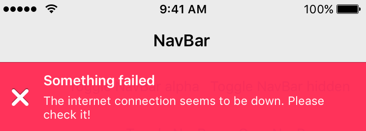
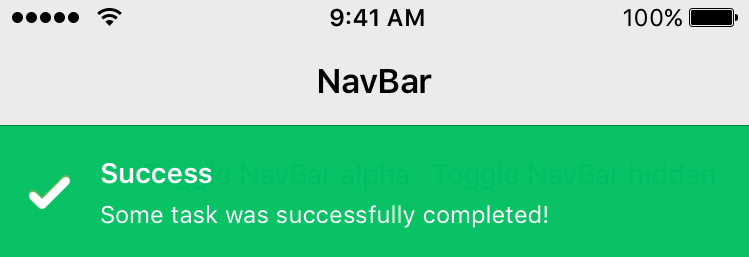
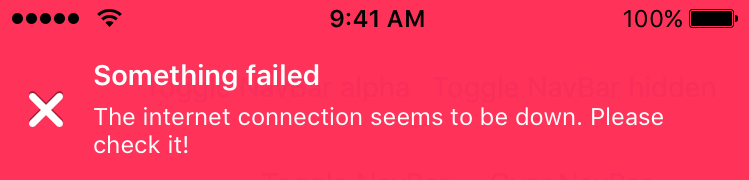
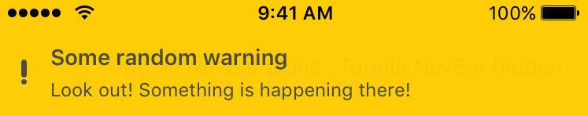

RMessage
==========

[](https://twitter.com/donileo)
[](http://cocoadocs.org/docsets/RMessage)
[](http://cocoadocs.org/docsets/RMessage)
[](http://cocoadocs.org/docsets/RMessage)

# Intro

Welcome to RMessage! RMessage is a reworking of the original [TSMessages](https://github.com/KrauseFx/TSMessages) library  developed by Felix Krause (@KrauseFx). It modernizes/refactors a lot of the old code to be a lot cleaner, simpler to understand and more Objective-C idiomatic. Here are some of the changes:

* Uses Autolayout instead of error prone spring/struts frame setting :).
* Various bugs have been fixed with regards to positioning of the notification view - For example: The view sizes itself properly under the status bar now allowing the status bar to show.
* Lots of Code Cleanup:
  * Code base much cleaner and easier to understand by removing confusing patterns and duplication.
  * Methods have been kept down to small LOC though with room for improvement.
* Allows the adding of custom designs without having to subclass the class by just adding new json "theme's" inside a custom design file of your choosing - Custom designs are additive so you still have access to the default designs as well.
* Various new customization options have also been added such as the ability to change:
  * The opacity of individual notification messages via the "alpha" key in your custom Designs.
  * Title and Subtitle labels no longer need to have the same shadows applied.
* Custom Design icon image no longer needs to be a fixed size. Notification sizes itself accordingly.
* No need to worry about missing a key in your design file. If not specified the default design takes over.
* Removed Old Blur code which was broken when iOS7 was introduced - There is no proper way to properly implement this currently so please dont submit features asking for this to be added until Apple adds an API enabling it.
* Better default view controller detection with use of PPTopMostController. TSMessages would assume the window root view controller would be the default view controller. This could cause issues with showing in modals for example.
* Removed the forcing of a specific design - TSMessages forced an iOS7 design or iOS6. Here there is no distinction - though the library is styled for iOS7 by default.
* Much more im sure :).
*

Note: Buttons within RMessage are not currently fully supported as in TSMessages but will be soon.

# Description
The notification moves from the top of the screen underneath the navigation bar and stays there for a few seconds, depending on the length of the displayed text. To dismiss a notification before the time runs out, the user can swipe it to the top or just tap it.

There are 4 different types already set up for you: Success, Error, Warning, Normal (take a look at the screenshots)

It is very easy to add new notification types with a different design.

1. Add the new type to the messageType enum.
2. Create a new configuration file and add it to RMessage by calling [RMessage addDesignsFromFileWithName:inBundle:]
3. Present the notification with your custom design by calling any of the class methods on RMessageView with the type as RMessageTypeCustom and the CustomTypeString equal to the key corresponding to your theme in the configuration file.

**Take a look at the Example project to see how to use this library.** Make sure to open the workspace, not the project file, since the Example project uses cocoapods.

Get in contact with the developer on Twitter: [donileo](https://twitter.com/donileo) (Adonis Peralta)

# Installation

## From CocoaPods
RMessage is available through [CocoaPods](https://cocoapods.org/). To install
it, simply add the following line to your Podfile:

    pod "RMessage"

## Manually
Copy the source files RMessageView and RMessage into your project. Also copy the RMessageDefaultDesign.json.

# Usage

To show notifications use the following code:

```objective-c
    [RMessage showNotificationWithTitle:@"Your Title"
                                subtitle:@"A description"
                                    type:RMessageTypeError
                                    customTypeName:nil
                                    callback:nil];


    // Add an icon image inside the message, appears on the left
    [RMessage showNotificationInViewController:self
                                          title:@"Update available"
                                       subtitle:@"Please update the app"
                                          iconImage:iconUIImageHere
                                           type:RMessageTypeNormal
                               customTypeName:nil
                                       duration:RMessageDurationAutomatic
                                       callback:nil
                                    buttonTitle:@"Update"
                                 buttonCallback:^{
                                     NSLog(@"User tapped the button");
                                 }
                                     atPosition:RMessagePositionTop
                           canBeDismissedByUser:YES];


    // Use a custom design file must be a json file though no need to include the json extension in the argument
    [RMessage addDesignsFromFileWithName:@"AlternativeDesigns" inBundle:[NSBundle mainBundle]]; // has an @"alternate-error" key specified with custom design properties
    [RMessage showNotificationWithTitle:@"Your Title"
                                subtitle:@"A description"
                                    type:RMessageTypeCustom
                                    customTypeName:@"alternate-error"
                                    callback:nil];
```

You can define a default view controller in which the notifications should be displayed:
```objective-c
   [RMessage setDefaultViewController:myNavController];
```

You can customize a message view, right before it's displayed, like setting an alpha value, or adding a custom subview
```objective-c
   [RMessage setDelegate:self];

   ...

   - (void)customizeMessageView:(RMessageView *)messageView
   {
      messageView.alpha = 0.4;
      [messageView addSubview:...];
   }
```

You can customize message view elements using UIAppearance
```objective-c
#import "RMessageView.h"
@implementation AppDelegate
....

- (BOOL)application:(UIApplication *)application didFinishLaunchingWithOptions:(NSDictionary *)launchOptions
{
//If you want you can override some properties using UIAppearance
[[RMessageView appearance] setTitleFont:[UIFont boldSystemFontOfSize:6]];
[[RMessageView appearance] setTitleTextColor:[UIColor redColor]];
[[RMessageView appearance] setSubtitleFont:[UIFont boldSystemFontOfSize:10]];
[[RMessageView appearance] setSubtitleTextColor:[UIColor greenColor]];
[[RMessageView appearance] setErrorIcon:[UIImage imageNamed:@"NotificationButtonBackground"]];
[[RMessageView appearance] setSuccessIcon:[UIImage imageNamed:@"NotificationButtonBackground"]];
[[RMessageView appearance] setMessageIcon:[UIImage imageNamed:@"NotificationButtonBackground"]];
[[RMessageView appearance] setWarningIcon:[UIImage imageNamed:@"NotificationButtonBackground"]];
//End of override

return YES;
}
```

The following arguments can be passed in programmatically when creating a new notification:

* **viewController**: The view controller to show the notification in. This might be the navigation controller.
* **title**: The title of the notification view
* **subtitle**: The text that is displayed underneath the title (optional)
* **iconImage**: A custom icon image that is used instead of the default one (optional)
* **type**: The notification type (Message, Warning, Error, Success, Custom)
* **duration**: The duration the notification should be displayed
* **callback**: The block that should be executed, when the user dismissed the message by tapping on it or swiping it to the top.
* **customTypeName**: When using a custom design that you have added specify the key to use from your design, otherwise set to nil if not using a custom design.

Except the title and the notification type, all of the listed values are optional

If you don't want a detailed description (the text underneath the title) you don't need to set one. The notification will automatically resize itself properly.

## Custom Design File Properties

* **backgroundColor**: Background color for the RMessage. String: [#000000, #FFFFFF].
* **opacity**: Opacity of the RMessage. Numeric: [0, 1.0].
* **iconImage**: Filename of image (in app bundle) to use as an icon on the left side of the RMessage. String.
* **iconImageRelativeCornerRadius**: Corner radius percentage relative to icon image to apply to icon image. For example 0.5 (use 50% of icon image width as corner radius) would mask the icon image to always be a circle. Numeric: [0, 1.0].
* **backgroundImage**: Filename of image (in app bundle) to use as a background image for the RMessage. String.
* **titleTextColor**: Color of the title text. String: [#000000, #FFFFFF].
* **titleFontName**: Name of font to use for title text. String.
* **titleFontSize**: Size of the title font. Numeric: [0, Max depending on font used]
* **titleShadowColor**: Color of the title shadow. String: [#000000, #FFFFFF].
* **titleShadowOffsetX**: Amount of pt to offset in x direction title shadow from title text. Numeric.
* **titleShadowOffsetY**: Amount of pt to offset in y direction title shadow from title text. Numeric.
* **subTitleTextColor**: Color of the subtitle shadow. String: [#000000, #FFFFFF].
* **subTitleFontName**: Name of font to use for subtitle text. String.
* **subTitleFontSize**: Size of the subtitle font. Numeric: [0, Max depending on font used].
* **subTitleShadowColor**: Color of the subtitle shadow. String: [#000000, #FFFFFF].
* **subTitleShadowOffsetX**: Amount of pt to offset in x direction subtitle shadow from subtitle text. Numeric.
* **subTitleShadowOffsetY**: Amount of pt to offset in y direction subtitle shadow from subtitle text. Numeric.

Property keys are always strings, values can be string or numeric. If specifying a numeric value don't encapsulate the numeric value in a string.

[x,y] Signifies the range of values x to y that are allowed for the field.

For example:

```
"backgroundColor": "#FFFFFF",
"opacity": 1.0
```

## Screenshots

**Design Examples**









# License
RMessage is available under the MIT license. See the LICENSE file for more information.

# Recent Changes
Can be found in the [releases section](https://github.com/donileo/RMessage/releases) of this repo.
